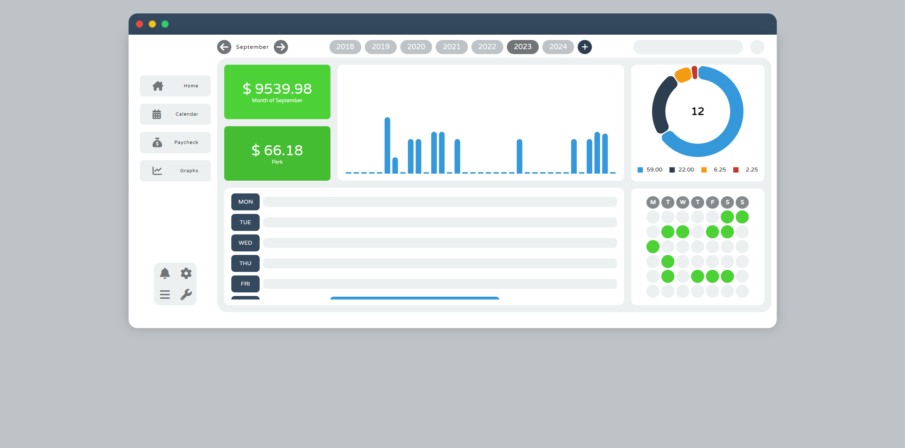
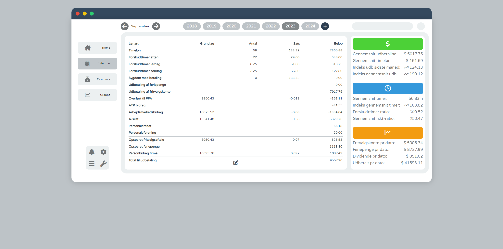

# Salary Checker v2.

This web-application is for logging my shifts at my job. I've developed this shift-managing tool due to the lack of features an ordinary excel-sheet offers. 

With is tool I am able to easily insert shifts into a payroll period, where it calculates the salary, including supplements such as late hours or hours in the weekend. Additionally, the page including 'Paycheck' is a copy of my actual paycheck, making sure everything is correct.

Graphs and statistics are always fun and serves a great purpose when containing the amount of data as here.

The tool are still in progress, missing elements on 'Graphs' and data is still yet to be inserted in the early years.

I'm really pleased with the overall design and modern-dashboard look. 

